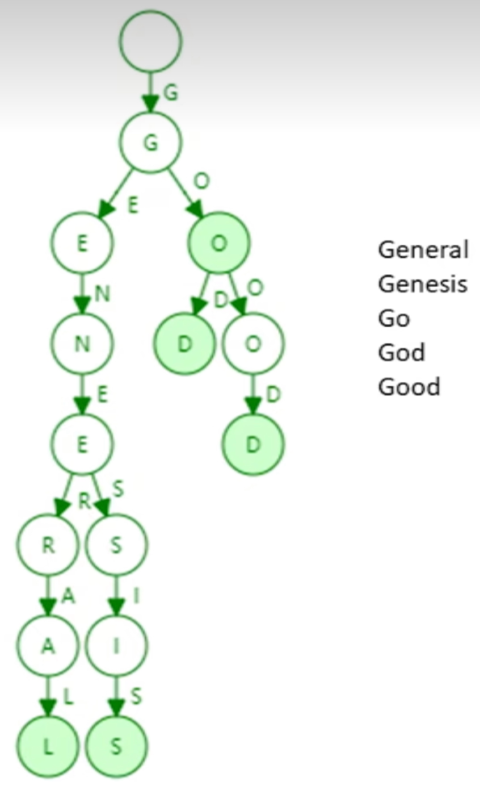
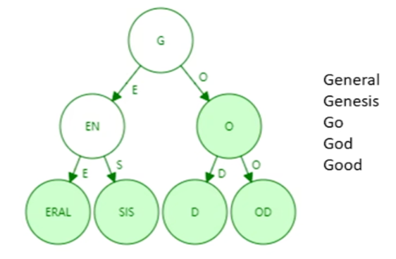
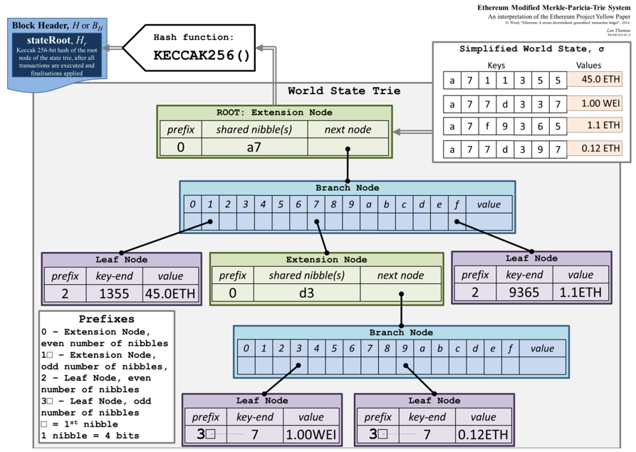
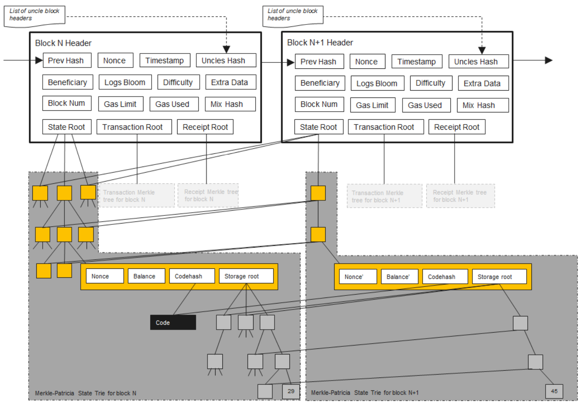
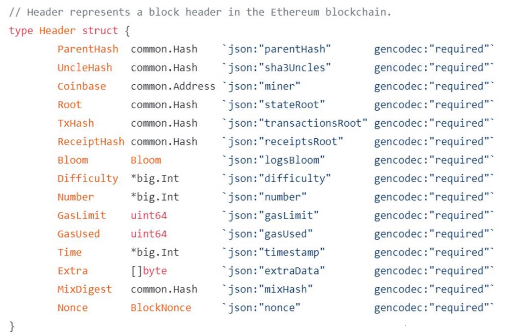
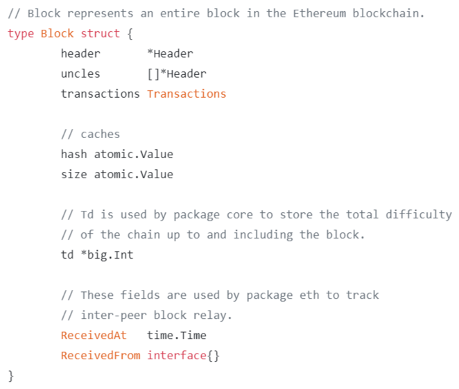
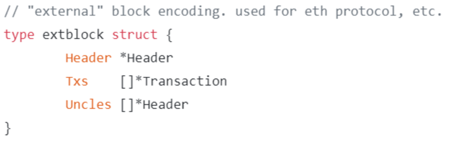

# 以太坊中的状态树

目标：账户地址到账户状态的映射。

address -> state
1. 账户地址address：
   - 地址是一个160位的二进制数，换成16进制就是40位（0x8f8b46E9183f5D8a89C9C7dC878eda5Ca2baFe6C）
   - 公钥取hash，然后截取了一部分。
2. 状态就是外部账户和合约账户的状态。 
3. 状态包括了余额、 交易次数nonce，合约账户还包含了code和storage。

设计什么数据结构来实现`address -> state`的映射？

最简单的是hashtable，不考虑hash碰撞。

但是如果要提供merkle proof，怎么办？

比如说你要跟某个人签合同，希望他能证明他有多少钱。怎么提供这个证明呢？

一种方法是把哈希表的内容组织称merkle tree。

如果有新区块发布的话，账户余额就会发生变化，哈希表就会发生变化，每次都重新构建merkle tree代码就很大。 

而比特币中，merkle tree是针对于每个区块的，构建了就不想要改变了。如果是把以太坊的所有账户构成一个merkle tree，那么每次交易发布都会发生变化。

除了提供merkle proof证明这个账户有多少钱外，merkle tree还有一个重要的作用，即维护各个全节点状态之间的一致性，用来确认各个节点之间的状态是一样的。

对于比特币来说，也是一样的，交易的root hash在所有节点要达成共识，确保交易在所有节点上都是一致的。

如果不用哈希表，直接构成merkle tree呢？

这个方法的问题在于： 
1. merkle tree没有提供一个高效的查找或者更新的方法。
2. 如果不规定账户在叶节点的出现顺序，那么构建的merkle tree就是不一样的。
   - 比特币中也是不排序的，为什么没有这个问题？因为比特币中，发布区块的节点确定后再进行同步就行。
   - 以太坊中，账户状态是维护在本地的，如果广播出去做同步代价太大，而且一个区块的交易也只会改变很少的账户。
3. 那如果使用sorted merkle tree呢？
   - 新增账户怎么办？插入的代价太大。

## PT

trie tree，字典树

分叉树有时叫做branching-factor.

特点：
1. trie的查找速度取决于string的长度，以太坊的地址是固定的40位。
2. 哈希表可能出现碰撞，但trie不会出现碰撞。
3. 输入列表的元素顺序不影响最终的构造
4. 每次发布一个区块，系统中绝大多数账户不变，更新trie时不需要更改整个trie，意味着更新的局部性非常好。

缺点：
1. 存储开销大

由于存储开销大，引入了`Patricia trie`，相当于路径压缩后的`trie`。

优点：树的高度减小了、稳定了，访问内存的次数减少了，提升了查找效率和存储效率。

新插入一个string，原有trie的压缩可能再次扩展开来。

字符分布比较稀疏的情况下路径压缩的效果比家好。

以太坊地址是160位的，也就是`2^160`，这是个非常大的空间，全世界的账户地址加在一起，也不值一提。
地址位数设置这么长的原因是因为 要避免地址产生碰撞，这是去中心化系统防止地址冲突的唯一办法。

正是因为地址这个稀疏的特性，非常适合`Patricia trie`。

## MPT
MPT: Merkle Patricia trie
相对于`Patricia trie`，PMT就是把节点的普通指针换成了哈希指针。

根哈希值也是写在区块头上，保证了每个节点的本地的账户状态的merkle tree都是一样的，维护了一致性。

根hash值能够提供merkle proof。
1. 证明账户余额：merkle tree上的对应链条发送给轻节点，轻节点就可以进行验证。
2. 证明某个发生了交易的账户是否存在
3. 防止篡改

## Modified MPT
以太坊选用的是Modified MPT。

1. Extension Node：出现路径压缩的节点
2. branch node: 分支节点，表明从这里开始分叉。
3. leaf node：叶子结点
4. 1nibble = 4bits
5. 指针指向的是一个哈希值

modified的地方在于 有extension Node和branch node的区分。

根哈希值是要写在block header中的。

## 状态改变
每次发布一个新的区块的时，状态树中有一些节点的值会发生变化，这些改变不是在原地改的，而是新建一些分支，原来的状态保留下来。

合约账户也是用MPT存储的，合约账户里面还有一个小的MPT。

为什么要保留修改前的状态。

因为软分叉是随时都会有的，当最长链胜出的时候，为了使得节点能够同步到最长链上，就需要回滚到分叉点再进行连接最长链，所以保留历史状态是必要的。

## 以太坊代码中的数据结构
### block header
1. ParentHash
2. UncleHash
3. Coinbase
4. Root: 状态树的root hash 
5. TxHash：交易树的root hash
6. ReceiptHash: 收据树的root hash

### 区块结构
1. header: 指向blocker header的指针
2. uncles：指向叔父区块的指针
3. transactions: 交易列表

### extblock
区块在网上真正发布时的信息：

## RLP

状态树中保存的是<key, value> pair，key就是地址，而value是通过RLP后保存的。

RLP: Recursive Length Prefix，一种进行序列化的方法.

常用的库：Protocol buffer（protobuf)。

只支持一种类型：nested array of bytes.

