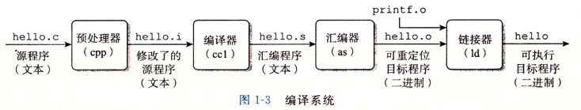
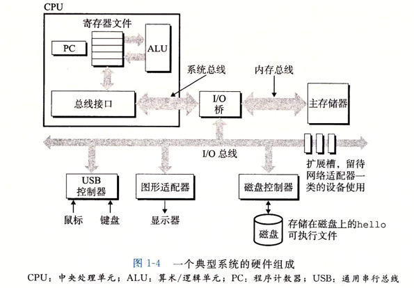

# 计算机系统漫游

## 信息就是 位 + 上下文

看下面一串代码hello.c，它实际上就是一系列二进制序列。
```c
int main() {
    printf("hello, world\n");
    return 0;
}
```

大部分的现代计算机系统都使用ASCII标准来表示文本字符，ASCII标准用一个字节（8bit）来表示每个字符。

hello.c程序是以字节序列的方式存储在文件中的。

## 程序被其他程序翻译成不同的格式
在操作系统上，更低级的语言来将代码转换为机器可识别的指令，然后这些指令按照一种称为「可执行目标程序」的格式打包好，并以二进制磁盘文件的形式存放起来。

Unix系统中，该代码的执行流程为：


1. 预处理阶段
2. 编译阶段：将程序翻译为汇编代码
3. 汇编阶段：将汇编代码翻译为机器语言指令
4. 链接阶段：合并一些需要的目标文件，比如printf函数存在一个单独的预编译好了的目标文件中，链机器就负责合并它。最后就得到了一个可执行的目标文件，就可以加载到内存中，由系统执行

## 处理器读并解释存储在内存中的指令

### 系统的硬件构成

为了理解运行hello程序时发生了什么，我们需要了解一个典型系统的硬件知识。

1. 总线：
   1. 贯穿整个系统的一组电子管道，称为总线，它携带信息字节并负责在各个部件间传递。
   2. 通常总线被设计为传送定长的字节，这是一个基本的系统参数。平时说的32位机器就是4个字节，64位机器就是8个字节。
2. I/O 设备：
   1. IO（input/output）设备就是系统与外部世界的联系通道，比如键盘、鼠标、硬盘、显示器等。
   2. 每个IO设备都通过一个适配器与IO总线相连，
3. 主存：主存是一个临时存储设备，也就是我们平时说的内存。主存用于在执行程序时，用来存放程序和其所需的数据。主存物理上来说是由一组动态随机存取存储器（DRAM）组成的。
4. 处理器：CPU，是解释或执行存储在主存中的指令的引擎。




